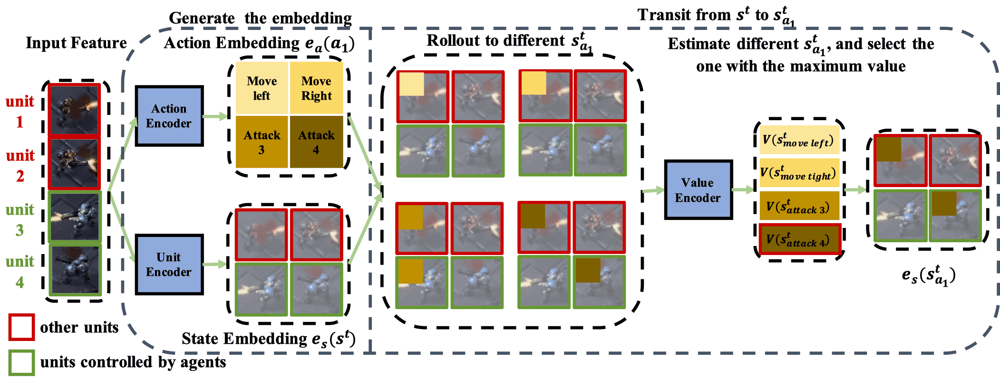

# ACE: Cooperative Multi-agent Q-learning with Bidirectional Action-Dependency

**ACE casts the problem of MARL as a sequential decision making process.**



> [**ACE: Cooperative Multi-agent Q-learning with Bidirectional Action-Dependency**](https://arxiv.org/abs/2211.16068)               
> Chuming Li, Jie Liu, Yinmin Zhang, Yuhong Wei, Yazhe Niu, Yaodong Yang, Yu Liu, Wanli Ouyang
> *[arXiv:2211.16068](https://arxiv.org/abs/2211.16068)* 

	
[](https://paperswithcode.com/sota/smac-on-smac-3s5z-vs-3s6z-1?p=ace-cooperative-multi-agent-q-learning-with)
[](https://paperswithcode.com/sota/smac-on-smac-6h-vs-8z-1?p=ace-cooperative-multi-agent-q-learning-with)
[](https://paperswithcode.com/sota/smac-on-smac-corridor?p=ace-cooperative-multi-agent-q-learning-with)
[](https://paperswithcode.com/sota/smac-on-smac-mmm2-1?p=ace-cooperative-multi-agent-q-learning-with)
## Updates

- (11/2022) Code has been released!


## Replay
See some interesting demo and replay in [issue](https://github.com/opendilab/ACE/issues/1).

## Installation

### All scripts

The scripts from installation to execution are all here👏.

```
# install starcraft
conda create -n ace python=3.8
wget https://blzdistsc2-a.akamaihd.net/Linux/SC2.4.10.zip
unzip SC2.4.10.zip
export SC2PATH="StarCraftII"
pip install pysc2 protobuf==3.19.5

# install grf
apt-get update && apt-get install git cmake build-essential libgl1-mesa-dev libsdl2-dev \
    libsdl2-image-dev libsdl2-ttf-dev libsdl2-gfx-dev libboost-all-dev \
    libdirectfb-dev libst-dev mesa-utils xvfb x11vnc -y \
    && apt clean \
    && rm -rf /var/cache/apt/*
python3 -m pip install --upgrade pip setuptools psutil wheel
git clone https://github.com/google-research/football.git
cp ACE/dizoo/gfootball/scenarios/academy_counterattack_hard.py football/gfootball/scenarios/academy_counterattack_hard.py
cd football
pip install -e .

# install ace
git clone https://github.com/opendilab/ACE
cd ACE
pip install -e .

cd exp/smac/2c_vs_64zg
python config.py
cd exp/grf/academy_3_vs_1_with_keeper
python config.py
```

### Install environment

#### Installing StarCraft II

##### Linux

Please download the Linux version of [StarCraft II](https://blzdistsc2-a.akamaihd.net/Linux/SC2.4.10.zip) from the Blizzard's repository and make sure the downloaded version of SC2 is 4.10.

##### Windows

Please install StarCraft II from [Battle.net](https://battle.net/).  You may need to set the `SC2PATH` environment variable.

#### Installing Google Research Football

Following the settings in CDS, we also make a reasonable change to the two half-court offensive scenarios: we will lose if our players or the ball returns to our half-court. For users who installed grf using the pip install method, maps can be modified using the following command,

```bash
pip install gfootball
cp ACE/dizoo/gfootball/scenarios/academy_counterattack_hard.py /opt/conda/lib/python3.8/site-packages/gfootball/scenarios/academy_counterattack_hard.py
```

For users who wants to install GRF from sources using GitHub repository, please refer to [GRF](https://github.com/google-research/football). Then users can modify the maps directly in the GRF repository.

### Install ACE

```
git clone https://github.com/opendilab/ACE
cd ACE
pip install -e .
```

## Getting Started

### SMAC

```
cd exp/smac/2c_vs_64zg
python config.py
```

### GRF

```
cd exp/grf/academy_3_vs_1_with_keeper
python config.py
```

## Results
### SMAC

### GRF


## License

This project is released under the Apache 2.0 license. See [LICENSE](LICENSE) for details.

## Citing ACE
If you use ACE in your research or wish to refer to the baseline results published here, please use the following BibTeX entry.

```BibTeX
@inproceedings{li2023ace,
  title={ACE: Cooperative Multi-agent Q-learning with Bidirectional Action-Dependency},
  author={Li, Chuming and Liu, Jie and Zhang, Yinmin and Wei, Yuhong and Niu, Yazhe and Yang, Yaodong and Liu, Yu and Ouyang, Wanli},
  booktitle={Proceedings of the AAAI Conference on Artificial Intelligence},
  year={2023}
}
```