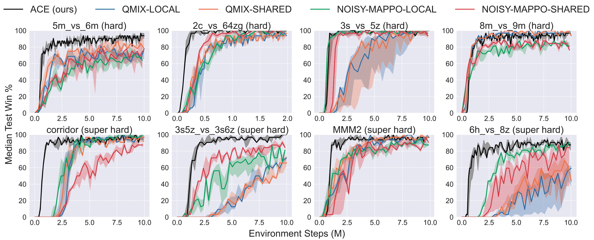

# ACE: Cooperative Multi-agent Q-learning with Bidirectional Action-Dependency

**ACE casts the problem of MARL as a sequential decision making process.**


## Updates
- (11/2022) Code will be released.

## Results



## License

This project is released under the Apache 2.0 license. See [LICENSE](LICENSE) for details.

## Citing ACE
If you use ACE in your research or wish to refer to the baseline results published here, please use the following BibTeX entry.

```BibTeX
@inproceedings{li2023ace,
  title={ACE: Cooperative Multi-agent Q-learning with Bidirectional Action-Dependency},
  author={Li, Chuming and Liu, Jie and Zhang, Yinmin and Wei, Yuhong and Niu, Yazhe and Yang, Yaodong and Liu, Yu and Ouyang, Wanli},
  booktitle={Proceedings of the AAAI Conference on Artificial Intelligence},
  year={2023}
}
```